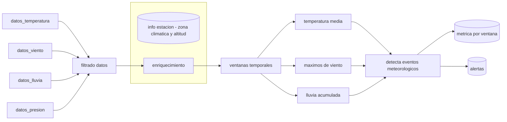

# Deteccion de eventos meteorologicos

## Descripcion proyecto
Este proyecto simula un pipeline de detección de eventos meteorológicos en tiempo real, inspirado en Spark Structured Streaming, utilizando Python y pandas.
El sistema procesa mediciones meteorológicas de múltiples estaciones, las agrega mediante ventanas temporales tumbling y genera métricas y alertas por estación y por ventana.
La salida está diseñada con mentalidad de producción: métricas tabulares listas para almacenarse en CSV o Parquet, y ser consumidas por sistemas analíticos, dashboards o pipelines downstream.

##  Pipeline de detección de eventos meteorológicos

## Descripción de los datos
### Datos meteorológicos

Cada registro representa una observación meteorológica:
- timestamp (event time)
- station_id
- temperature
- wind_speed
- rainfall

Las mediciones llegan de forma asíncrona y con frecuencia irregular.

### Datos estaciones
Los atributos de las estaciones se almacenan por separado y se incorporan durante el enriquecimiento:
- altitude
- climate_zone

## Enriquecimiento de los datos
Las mediciones dinámicas se enriquecen mediante un left join usando station_id, garantizando que no se pierdan observaciones.
Las variables estáticas se propagan a nivel de ventana utilizando la agregación first(), al ser invariantes en el tiempo.

## Salida de los datos
Ventanas de 1 minuto
- Alta resolución temporal
- Mayor ruido
- Sobre-detección de eventos

Ventanas de 5 minutos
- Métricas más estables
- Menos falsos positivos
- Mejor alineación con fenómenos meteorológicos

Se seleccionan ventanas de 5 minutos como configuración óptima.

## Conclusiones
- Los datos metorológicos se pueden agrupar por ventanas.
- El dataset no tiene valores altos apreciables.
- Podemos simular Apache Spark Streaming empleando pandas.

## Futuras mejoras
El sistema queda preparado para extenderse con:
- Watermarks
- Agregaciones con estado
- Ejecución distribuida con Spark