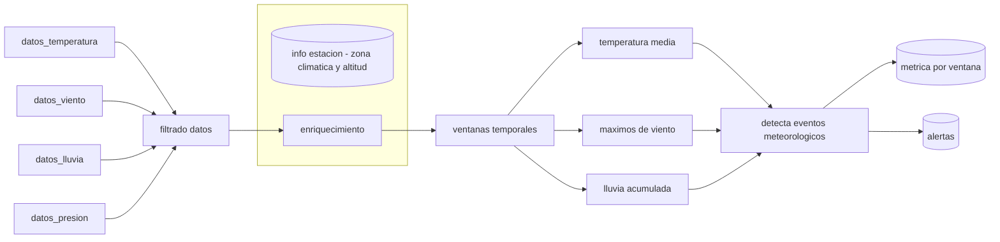

##  Pipeline de detección de eventos meteorológicos

```mermaid
flowchart LR

    %% Fuentes de datos
    datos_temperatura[datos_temperatura]
    datos_viento[datos_viento]
    datos_lluvia[datos_lluvia]
    datos_presion[datos_presion]

    %% Proceso previo
    filtrado[filtrado datos]

    %% Subgrafo para forzar verticalidad
    subgraph EnriquecimientoContextual [ ]
        direction TB
        info_estacion[(info estacion - zona climatica y altitud)]
        enriquecimiento[enriquecimiento]
    end

    %% Ventanas y métricas
    ventanas[ventanas temporales]
    temp_media[temperatura media]
    max_viento[maximos de viento]
    lluvia_acum[lluvia acumulada]

    %% Detección y salidas
    deteccion[detecta eventos meteorologicos]
    metricas[(metrica por ventana)]
    alertas[(alertas)]

    %% Flujos
    datos_temperatura --> filtrado
    datos_viento --> filtrado
    datos_lluvia --> filtrado
    datos_presion --> filtrado

    filtrado --> enriquecimiento
    enriquecimiento --> ventanas

    ventanas --> temp_media
    ventanas --> max_viento
    ventanas --> lluvia_acum

    temp_media --> deteccion
    max_viento --> deteccion
    lluvia_acum --> deteccion

    deteccion --> metricas
    deteccion --> alertas
```
